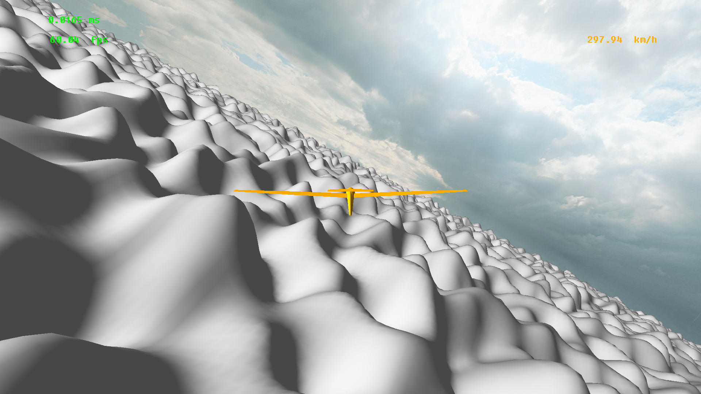
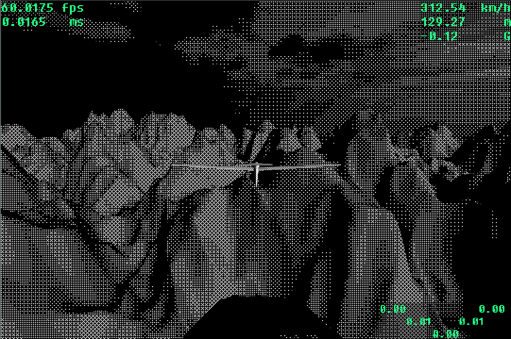

# Wind
A 3D physics-based flight simulator rendered with OpenGL. \
Simulating the fundamental aerodynamic forces that act on an aircraft during flight to create a fun flying experience.

<!--  -->


Longer video [here](https://gsracz.com/wind.mp4)
## Build & Run:

### Linux:
1. Clone repository:
    
		git clone https://github.com/gabrielracz/Wind.git

2. Install dependencies (cmake, glew, glfw, glm):

    #### Debian

		sudo apt install build-essential cmake libglfw3-dev libglew-dev libglm-dev

    #### Fedora

        sudo dnf group install "C Development Tools and Libraries"
        sudo dnf install glew-devel glfw-devel glm-devel

3. Build and run:
		
		mkdir build
		cd build
		cmake ..
		make
		./wind

### Windows

1. Clone repository:
    
		git clone https://github.com/gabrielracz/Wind.git

2. Have [CMake](https://cmake.org/download/) and [Visual Studio](https://visualstudio.microsoft.com/downloads/) Installed

3. Create solution:
		
		mkdir build
		cd build
		cmake ..

4. Open ```wind.sln``` and build Release x64

5. Run

        ./Release/wind.exe
