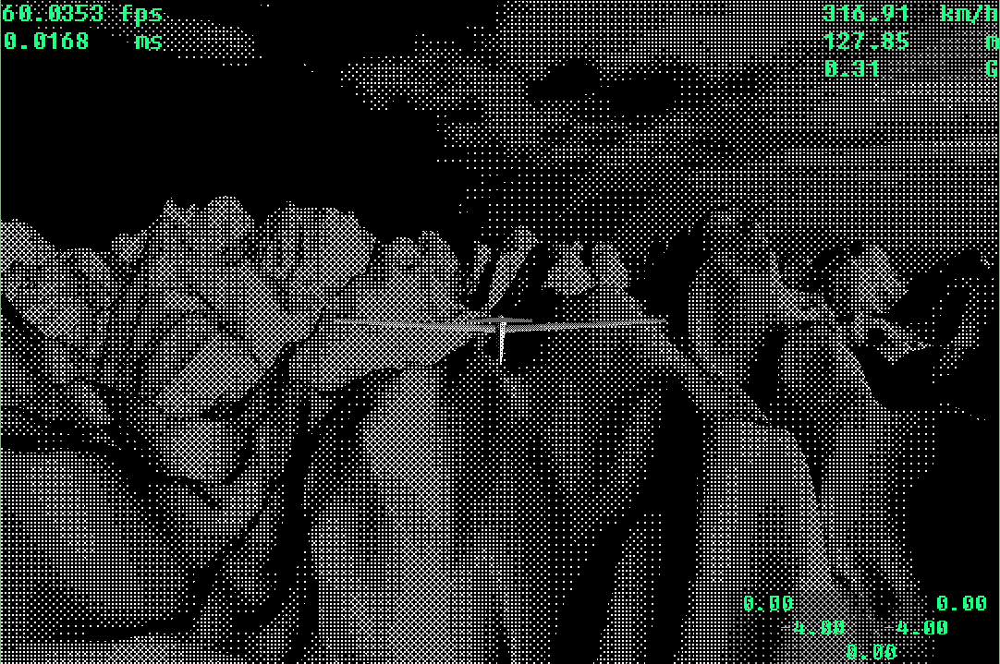

# Wind
A 3D physics-based flight simulator rendered with OpenGL. \
Simulating the fundamental aerodynamic forces that act on an aircraft during flight to create a fun flying experience.

<!--  -->

Build & Run:

1. Install libs (Cmake, GLEW, GLFW, GLM):

		sudo apt install build-essential cmake libglfw3-dev libglew-dev libglm-dev
2. Clone repository:
    
		git clone https://github.com/gabrielracz/Wind.git
3. Build and run:
		
		mkdir build
		cd build
		cmake ..
		make
		./wind
